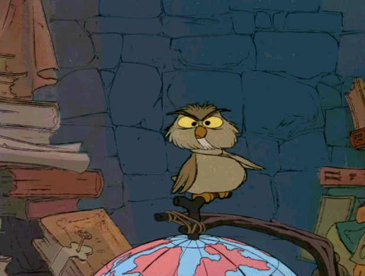
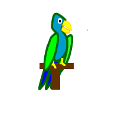
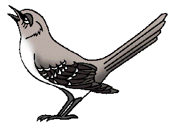
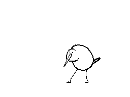
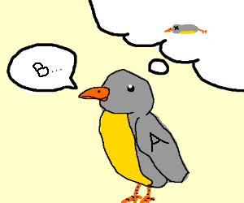
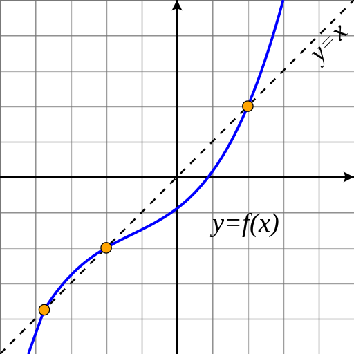
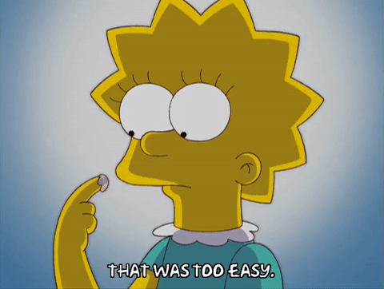

## The Sage Bird



---

## Talking birds forest

There's a magic forest populated by talking birds...


+++

If you call out B to A bird, it will answer calling bird x: *AB = x*



+++

* In the forest exist a Mocking bird such that *Mx = xx*.



+++

Given any two birds A and B, C is *Cx = A(Bx)*.



---

## Fond, normal and happy birds

There are several kinds of birds in the forest

+++

### Fond and normal bird

We say that **A is fond to B** when *AB = B*.



Fond bird are normal too

+++

### Happy bird

A bird is **happy** if *Ax = y* and *Ay = x*


---

## Larks

A bird L is a Lark if *(Lx)y = x(yy)*


+++

Lark is a very special bird, because its presence in the forest ensure that all the other birds are fond to at least another one. 

This is a wonderful effect, infact every bird are normal and happy as well!

+++
- Suppose there are a lark L and any x,y birds, so *(Lx)y = x(yy)*

- This is true for *y = Lx* as well, and so *(Lx)(Lx) = x((Lx)(Lx))*

- We can say then that **x is fond to (Lx)(Lx) and so normal as well**

---

## The Sage bird

> Is there some special bird which, whenever I call out the name of a bird x to it, will respond by naming a bird of which x is fond?

*x(&theta;x) = &theta;x*

+++

### Is there a Sage Bird in the forest?

+++

It's not possible to be sure about sage bird's existence by C1 and C2 only.

But...

We know that exist a bird that is the composition of X and the mockingbird M.

+++

*Cv = X(Mv)*, and so we know that X is fond to yy.

*Yv = X(Mv) => (YY = X(MY)) => (X(YY) = YY)*

+++

 How can we found a y bird that is the composition of X and M?

> A bird A that answer back y that is the composition of x and M

+++

### Searching for A...

Ax composing x to M for every x is the same of

*(Ax)y = x(My)* for every x and y.

(*Cx = A(Bx) where C is Ax; x = y; A = x; B = M*)

+++
But *x(My) = x(yy)*

and so *(Ax)y = x(yy)*
+++
Who is that bird A such as *(Ax)y = x(yy)*

***The Lark***
+++

What if a mockingbird M and a lark L are present in the forest and composition law holds?

+++

Every x is fond to *(Lx)(Lx)*

and so x is fond to *M(Lx)* as well

+++

By composition laws it must exist a bird composing M and L

*&theta;x = M(Lx)*

+++
Since x is fond to M(Lx) and *M(Lx) = &theta;x*

x is fond to &theta;x...
+++

*x(&theta;x) = &theta;x*

&theta; is the sage bird aka ***fixed point combinator***

---

### Fixed Point in Practice

Try to repeatedly hit a calculator's cos key starting from 0.

+++

The function converge to a fixed value.

In general an f's fix point is where *x = f(x)*



+++

Notice that x could be a function as well and so *fixpoint-function = f(fixpoint-function)*

---

### Factorial Function

```scala
def factorial(n: Int): Int = n match {
    case 0 => 1
    case x => x * factorial(x - 1)
  }
```
+++

### Puzzle

*Is it possible to create a non recursive factorial function? (avoiding the use of imperative operators)*

+++

```scala
def factFLazy(f: => (Int => Int)): Int => Int = { n =>
    if (n == 0) 1
    else n * f(n - 1)
 }
```

+++

We just renamed recursive call to factorial with f that it's provided as an argument to *factFLazy*.

*factFLazy* is an higher-order function, returning another function wich will be the factorial one.



+++

### factorial via factLazy

Suppose you have *factA* function able to compute factorials:

```scala
def factA(num: Int) : Int = factorial(num)
```

Consider *factB*

```scala
val factB: Int => Int = factFLazy(factA)
```
+++

Does *factB* computes factorials as well?

+++

```scala
scala> factB(5)
res0: Int = 120
```

Hence, given a factorial f function, factFLazy will return a f' that will compute factorials.

+++

Assuming *f' = f* then we have:

```scala
val fact: Int => Int = factFLazy(fact)

scala> fact(5)
res1: Int = 120
```
---

### factorial via induction

```scala
val identity: Int => Int = { (x: Int) => x }
val fact0: Int => Int = factFLazy(identity)
```
+++

*fact0* can compute just the factorial's number of 0

```scala
scala> fact0(0)
res2: Int = 1

scala> fact0(1) // wrong
res3: Int = 0
```
+++

We can define *fact1* in terms of *fact0*

```scala
scala> val fact1: Int => Int = factFLazy(fact0)
fact1: Int => Int = $$Lambda$19709/1162672363@6cb8860

scala> fact(1)
res4: Int = 1
```
+++

 We can define factN in terms of factN-1 using *factFLazy*

```scala
val fact2: Int => Int = factFLazy(fact1)

val fact3: Int => Int = factFLazy(fact2)

val fact4: Int => Int = factFLazy(fact3)

val fact5: Int => Int = factFLazy(fact4)

scala> fact5(5)
res5: Int = 120
```
+++

*fact* function is the **fixed point** of *factFLazy*

```scala
val fixFact: Int => Int = factFLazy(fixFact)
```
---

## The Sage Bird again

Knowing that *factorial* is the *factFLazy*'s fixed point doesn't tell us how to compute it.

We'd need a function that receives another function like *factFLazy* as argument and returns the *factFLazy*'s fixed point

+++

> *Some special bird which, whenever I call out the name of a bird x to it, will respond by naming a bird of which x is fond*.

+++
### Derivation

*&theta;f = fix-poinf-f*

+++

*f(fix-point-f) = fix-point-f* by definition of fix point *(cos x = x)*

+++

Hence *&theta;f = f(fix-point-f)* and so *&theta;f = f(&theta;f)*

---

## Y-Combinator in Scala

```scala
def Y[T](f: (T => T) => (T => T)): T => T = f(Y(f))(_:T)

def factF(f: Int => Int): Int => Int = { n =>
  if (n == 0) 1
  else n * f(n - 1)
}

def factorial: Int => Int = Y[Int](factF)
```
+++

```scala
scala> factorial(5)
res6: Int = 120
```
