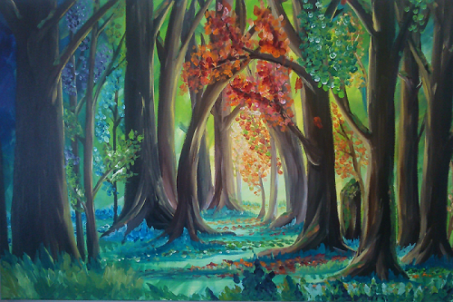
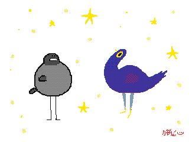
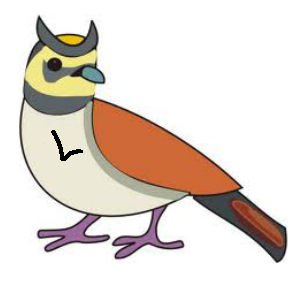

## The Sage Bird

---

## Talking birds forest

There's a magic forest populated by talking birds...

+++

If you call out B to A bird, it will answer calling bird x: *AB = x*

+++

* In the forest exist a Mocking bird such that *Mx = xx*.

+++

Given any two birds A and B, C is *Cx = A(Bx)*.

---

## Fond, normal and happy birds

There are several kinds of birds in the forest

+++

### Fond and normal bird

We say that **A is fond to B** when *AB = B*.

Fond bird are normal too

+++

### Happy bird

A bird is **happy** if *Ax = y* and *Ay = x*

---

## Larks

A bird L is a Lark if *(Lx)y = x(yy)*

+++

Lark is a very special bird, because its presence in the forest ensure that all the other birds are fond to at least another one. 

This is a wonderful effect, infact every bird are normal and happy as well!

+++
- Suppose there are a lark L and any x,y birds, so *(Lx)y = x(yy)*

- This is true for *y = Lx* as well, and so *(Lx)(Lx) = x((Lx)(Lx))*

- We can say then that **x is fond to (Lx)(Lx) and so normal as well**

---

## The Sage bird

> Is there some special bird which, whenever I call out the name of a bird x to it, will respond by naming a bird of which x is fond?

*x(&theta;x) = &theta;x*

+++

### Is there a Sage Bird in the forest?

+++

It's not possible to be sure about sage bird's existence by C1 and C2 only.

But...

We know that exist a bird that is the composition of X and the mockingbird M.

+++

*Cv = X(Mv)*, and so we know that X is fond to yy.

*Yv = X(Mv) => (YY = X(MY)) => (X(YY) = YY)*

+++

 How can we find a y bird that is the composition of X and M?

> A bird A that answer back y that is the composition of x and M

+++

### Searching for A...

Ax composing x to M for every x is the same of

*(Ax)y = x(My)* for every x and y.

(*Cx = A(Bx) where C is Ax; x = y; A = x; B = M*)

+++
But *x(My) = x(yy)*

and so *(Ax)y = x(yy)*
+++
Who is that bird A such as *(Ax)y = x(yy)*

***The Lark***
+++

What if a mockingbird M and a lark L are present in the forest and composition law holds?

+++

Every x is fond to *(Lx)(Lx)*

and so x is fond to *M(Lx)* as well

+++

By composition laws it must exist a bird composing M and L

*&theta;x = M(Lx)*

+++
Since x is fond to M(Lx) and *M(Lx) = &theta;x*

x is fond to &theta;x...
+++

*x(&theta;x) = &theta;x*

&theta; is the sage bird aka ***fixed point combinator***

---
